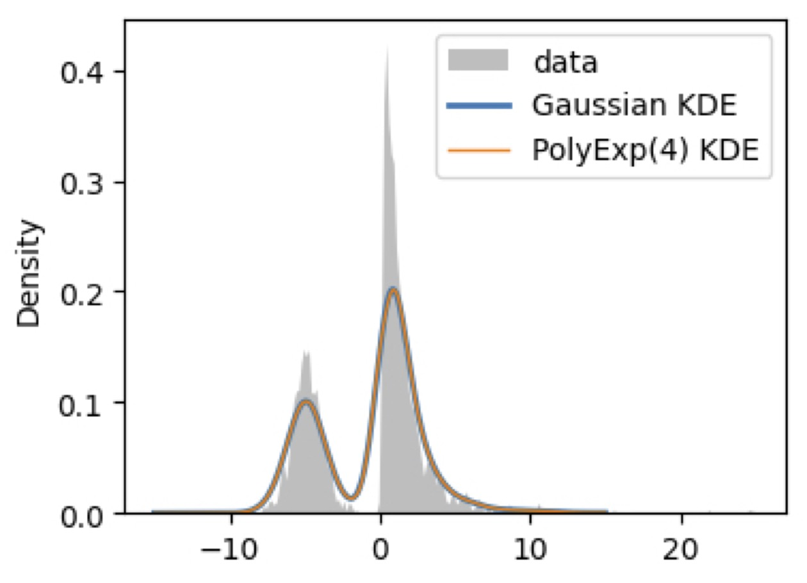
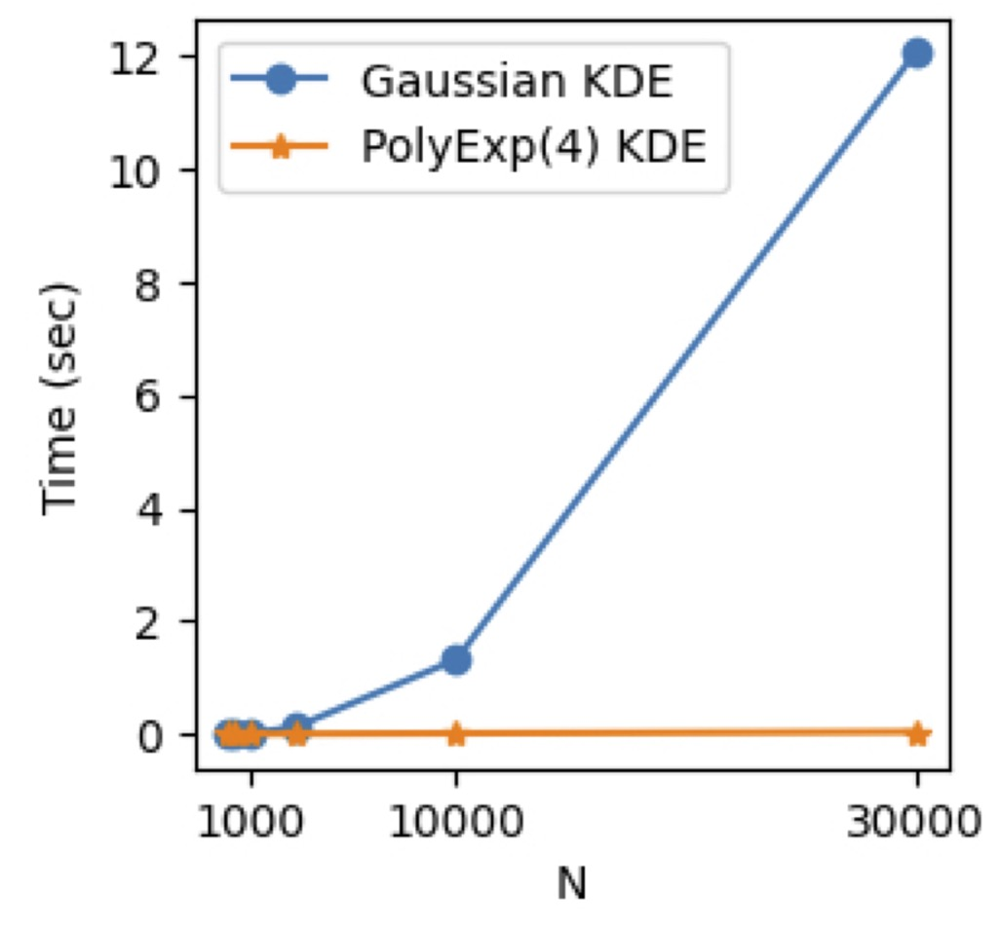

# PolyExpKDE

### Fast univariate kernel density estimation with the polynomial-exponential kernel

This is a Python / Numba implementation of kernel density estimation (KDE) with the polynomial-exponential kernel (Hofmeyr, 2019), which enables linear-complexity runtime. 

<figure>
  <figcaption><i>Accuracy</i></figcaption>
  
</figure>
<figure>
  <figcaption><i>Speedup</i></figcaption>
  
</figure>

Hofmeyr, David P. "Fast exact evaluation of univariate kernel sums." IEEE transactions on pattern analysis and machine intelligence 43.2 (2019): 447-458.

See also [https://github.com/DavidHofmeyr/FKSUM](https://github.com/DavidHofmeyr/FKSUM) for the original implementation in R/C++.

### Installation

```
pip install polyexpkde
```

Alternatively, install from source. After cloning this repo, install the dependencies on the command-line, then install polyexpkde:
```
pip install -r requirements.txt
pip install -e .
pytest
```

### Usage

See [examples/basic-example.ipynb](examples/basic-example.ipynb) for an example. This uses a sklearn-compatible BaseEstimator API, but we follow the example of `scipy.stats.gaussian_kde` by allowing you to specify the `bw_method`, which produces the factor that is multiplied with the standard deviation of the data. Sampling and 1d integration are also supported.

